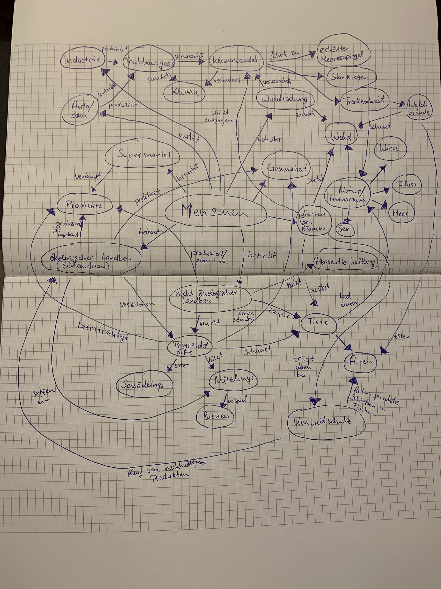

# Exposé

### Darstellung des Problemraums
Es ist schon lange kein Geheimnis mehr, dass der Mensch durch das Nutzen fossiler Brennstoffe, Waldrodungen und beispielsweise der Tierzucht das Klima und die Temperatur auf der Erde immens beeinflusst, was ein großes Problem hervorruft. Im Zusammenhang mit der vom Menschen verursachten globalen Erderwärmung wird vom sogenannten Treibhauseffekt gesprochen.
Das veränderte Klima führt zu Starkregen und anderen Niederschlägen, das Eis der Arktis, Antarktis und auf Grönland schmilzt und führt zu einem ansteigenden Meeresspiegel und zu Trockenheit, diese Trockenheit führt wiederum dazu das der Lebensraum vieler Pflanzen  zerstört wird, da sie an bestimmte Temperaturen angepasst sind und unter veränderten Klimabedingungen nicht überleben können. Des Weiteren begünstigt Trockenheit die Entstehung von Waldbränden. Obwohl Wälder bzw. Bäume eine sehr große Rolle und Position in Sachen Klimawandel, Artenschutz und Wasserspeicher spielen, werden neben der Zerstörung durch Waldbrände Bäume bzw. ganze Wälder illegal gerodet, fallen der Forstwirtschaft zum Opfer oder werden abgeholzt, um stattdessen zum Beispiel Palmölplantagen anzulegen oder an darunterliegende Rohstoffe zu kommen.

Umweltschädigend sind auch Pestizide und Gifte, welche vor allem flächendeckend in der Landwirtschaft eingesetzt werden. Pestizide können logischerweise nicht zwischen Schädling und Nützling unterscheiden, was dazu führt das Nützlinge nach kurze Zeit durch Pestizide ausgerottet werden und es so sehr schnell zu einem Neubefall durch Schädlinge kommen kann, was wiederum das erneute Einsetzen von Pestiziden hervorruft und zu einem nicht endenden Teufelskreis führt, welcher die Menge der eingesetzten Pestizide in die Höhe treibt. Kontinuierlicher Pestizideinsatz führt zur Resistenzbildung, sodass Landwirte verschiedene Pestizide einsetzen müssen und das führt zu einer sogenannten Mehrfachbelastung in Lebensmitteln, was die Gesundheit des Menschen beeinträchtigen kann. Da sich Pestizidwirkstoffe im Fettgewebe ablagern können, kommt es im Organismus zu hohen Schadstoffkonzentrationen vor allem bei Lebewesen, die am Ende der Nahrungsketten stehen.

Beim Menschen sind die großen Fischarten besonders begehrt, was dazu führt, dass die Nahrungskette von oben nach unten abgefischt wird, denn sobald die größeren Fischarten dezimiert wurden, werden die nächst kleineren Fischarten angepeilt, diese sind aber meist die Nahrung der zuvor angepeilten größeren Fische, so können sich die dezimierten Fischarten nicht erholen. 

### Zielsetzung/Vision
Der Klimawandel soll durch das Entgegenwirken der Wälder Dezimierung bekämpft werden, dies soll durch das Pflanzen neuer Bäume und das Entstehen neuer Wälder geschehen. Durch das Unterstützen des Biolandbaus und dem Kauf von Bioprodukten, soll dem Einsatz von Pestiziden entgegengewirkt werden, sodass Natur, Wasser und Lebensmittelqualität davon profitieren können.
Des Weiteren soll durch den Kauf von nachhaltigen Fischprodukten zur naturverträglichen Fischerei gelenkt werden.

### Relevanz
Durch das Projekt soll die Aufmerksamkeit des Verbrauchers mehr auf seine Umwelt und Mitmenschen gelenkt werden, somit weist es eine sehr hohe gesellschaftliche als auch wirtschaftlichen Relevanz auf, denn es wird strengstens darauf aufmerksam gemacht, dass sich in der heutigen Gesellschaft hinsichtlich des Klimawandels und unserer Umwelt etwas verändern muss.
Zusätzlich weist das Projekt auch eine hohe wissenschaftlich Relevanz auf, da es sich für den Schutz verschiedenster Tierarten einsetzt und auch die verschiedensten Lebensräume zu schützen versucht, sodass noch nicht entdeckte Tierarten nicht vor ihrer Entdeckung aussterben.

### Anwendungslogik
Das System bezieht Produktinformationen von einer API und soll diese nach Bioprodukten bzw. nachhaltigen Produkten filtern und einen prozentualen Teil des Einkaufwertes berechnen, ähnlich wie bei einem Paybacksystem. Des Weiteren soll der User die Wahl haben, wen und was er mit seinem prozentualen Teil unterstützen will (beispielsweise Amazonas in Brasilien oder Waldbrände in Australien). Der berechnete prozentuale Wert des Einkaufs wird an den Server geschickt, um das Geld zu verwalten und zu berechnen, wo und wie viele Bäume bereits gepflanzt wurden. So soll der User stetig einsehen können wie viel er zu den verschiedenen Projekten beigetragen hat.

### Domänenmodell

